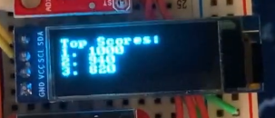
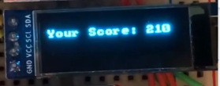
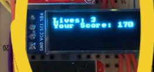
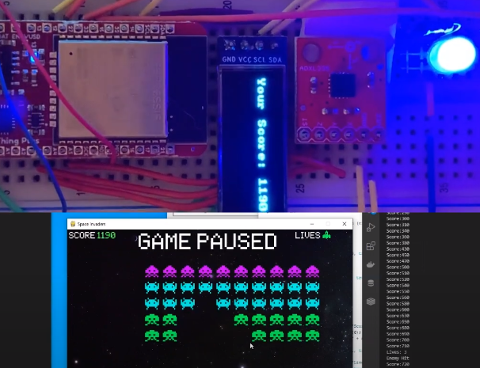
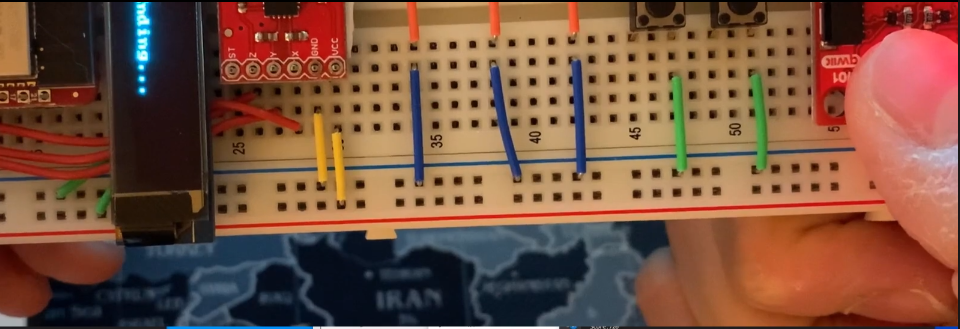

# Final Project Report

### Seok Jun Park

#### Project Partner: Kanishka Roy

Date: 06/08/2021

## Grand Challenge Part 1: Space Invader Controller

### **Improvement 1: 3 Levels of Movement**

To move the Space Invader smoother, we had to specify the conditions for sending an orientation from the MCU to the python so the Python can read how much our controller is now tilted while the user is playing the game.

### **Improvement 2: TOP 3 Scores on OLED Before Game Starts / After Game Ends**

To print out the top 3 scores on OLED before the game starts and after the game ends, we needed to stack the scores inside the **csv** file whenever the game ends. Then get a **numpy** array from the **csv** file, compare the values to determine the highest 3 scores.

### **Improvement 3: Current Score On OLED while playing game**

To print out the current score while the user is playing the game, we needed to figure out where the score is calculated in the main game file. There is **check_collision()** function in the main game file, and it checks the collisions between the bullet that the space invader shoots and the enemy or the mystery ship. Every time it checks the collision and calculates the current score, we send a message to MCU to print out the scores on OLED.

### **Improvement 4: Motor Buzzing & Yellow LED Blinks when Enemy Bullet Hits the Ship**

We implemented some arduino codes for the motor buzzing and yellow LED blinking when the Python is sending the data to MCU while the enemy bullet hits the ship during the game.

### **Improvement 5: Remaining Lives Printing on OLED when Enemy Bullet Hits the Ship**

When the game begins, the total lives of the ship is set to be 3. But whenever the enemy bullet hits the space invader ship, the lives are decreasing by 1. If the total lives become to 0, the game is done and restarts soon.

### **Improvement 6: Game Paused/Resumed & Blue LED Blinks**

If we press the right button, the game is paused and the blue LED blinks to let the user know the game is paused. Also, "GAME PAUSED" message pops up to the game monitor as well.

### **Improvement 7: Quit the Game Immediately when PPG Reading Activated**

To put one more of what we've learned throughout the quarter, we added the functionality to quit the game immediately if the **PPG Sensor** reads the higher value than a threshold. Once it detects the value higher than the threshold, the OLED prints out the **Ending...** message and the game is stopped.

### **Youtube Video Link for Game Playing**

Here is the video link of the **YouTube**  
https://www.youtube.com/watch?v=Sr_zmGJQP68

## Grand Challenge 2: Student Productivity Helper

### **Problem**

Our device is trying to help students stay productive with a distraction-free device that has all the features on their computer, but without any method to get distracted. It keeps the student focused with a Pomodoro timer, telling them what they should be working on based on their google calender, and reminding them of their habits throughout the day. Our target audience is younger students (grades 6 - 12) because they are more likely to be distracted and a simple device would make it easy for them to focus. Our solution solves the needs of the user by giving them a distraction-free method to focus and complete their work in a timely manner.

### **Design Process**

We choose to split our device into three seperate functions: pomodoro timer, calender support, and habit tracker. Each function has its own class. For the calender, we used a google API to make it easy to access events and display them. For the other two, we simply just created two completely custom classes. We used some techniques we learned throughout the quarter like using datetime objects and string parsing. We initally also had seperate main files to test. Then, once we verified that each function worked on its own, we combined it into 2 files. the first file housed all the classes. The second file was the main file and ran the code.

### **Features**

1. **Google Calender Support** - The device uses the google calender API to fetch your events for the next 24 hours. Then, when the event is live, it will buzz the motor and start the blue led to catch your attention that an event has changed. The OLED displays the start and end time of the event so you know how long you need to work for.
2. **Pomodoro Timer** - The timer will start a 30 minute focus timer, giving you messages at every 5 minutes how many minutes are left. After the timer is over, it will start a 15 minute break.
3. **Habit Tracker** - This will ask for your habits on first use. It will save any habits you want into a csv file for future uses. As the habits come throughout the day, it will display it on the oled for 2 minutes, and start the yellow LED. When the user is finished with the habit, they should press the right button and the LED will stop.

### Youtube link: https://youtu.be/3sDKym4WTyI
